Mini Data Analysis Milestone 2
================

*To complete this milestone, you can either edit [this `.rmd`
file](https://raw.githubusercontent.com/UBC-STAT/stat545.stat.ubc.ca/master/content/mini-project/mini-project-2.Rmd)
directly. Fill in the sections that are commented out with
`<!--- start your work here--->`. When you are done, make sure to knit
to an `.md` file by changing the output in the YAML header to
`github_document`, before submitting a tagged release on canvas.*

# Welcome to the rest of your mini data analysis project!

In Milestone 1, you explored your data. and came up with research
questions. This time, we will finish up our mini data analysis and
obtain results for your data by:

- Making summary tables and graphs
- Manipulating special data types in R: factors and/or dates and times.
- Fitting a model object to your data, and extract a result.
- Reading and writing data as separate files.

We will also explore more in depth the concept of *tidy data.*

**NOTE**: The main purpose of the mini data analysis is to integrate
what you learn in class in an analysis. Although each milestone provides
a framework for you to conduct your analysis, it’s possible that you
might find the instructions too rigid for your data set. If this is the
case, you may deviate from the instructions – just make sure you’re
demonstrating a wide range of tools and techniques taught in this class.

# Instructions

**To complete this milestone**, edit [this very `.Rmd`
file](https://raw.githubusercontent.com/UBC-STAT/stat545.stat.ubc.ca/master/content/mini-project/mini-project-2.Rmd)
directly. Fill in the sections that are tagged with
`<!--- start your work here--->`.

**To submit this milestone**, make sure to knit this `.Rmd` file to an
`.md` file by changing the YAML output settings from
`output: html_document` to `output: github_document`. Commit and push
all of your work to your mini-analysis GitHub repository, and tag a
release on GitHub. Then, submit a link to your tagged release on canvas.

**Points**: This milestone is worth 50 points: 45 for your analysis, and
5 for overall reproducibility, cleanliness, and coherence of the Github
submission.

**Research Questions**: In Milestone 1, you chose two research questions
to focus on. Wherever realistic, your work in this milestone should
relate to these research questions whenever we ask for justification
behind your work. In the case that some tasks in this milestone don’t
align well with one of your research questions, feel free to discuss
your results in the context of a different research question.

# Learning Objectives

By the end of this milestone, you should:

- Understand what *tidy* data is, and how to create it using `tidyr`.
- Generate a reproducible and clear report using R Markdown.
- Manipulating special data types in R: factors and/or dates and times.
- Fitting a model object to your data, and extract a result.
- Reading and writing data as separate files.

# Setup

Begin by loading your data and the tidyverse package below:

``` r
library(datateachr) # <- might contain the data you picked!
library(tidyverse)
```

# Task 1: Process and summarize your data

From milestone 1, you should have an idea of the basic structure of your
dataset (e.g. number of rows and columns, class types, etc.). Here, we
will start investigating your data more in-depth using various data
manipulation functions.

### 1.1 (1 point)

First, write out the 4 research questions you defined in milestone 1
were. This will guide your work through milestone 2:

<!-------------------------- Start your work below ---------------------------->

1.  Is the symmetry and fractal dimension of a tumour related? *These
    are two tumour attributes I am unfamiliar with that I would be
    interested in exploring.*
2.  How well can the diagnosis of a tumour be predicted by its radius,
    texture, smoothness, compactness, concavity, symmetry, and fractal
    dimension? *I am interested in seeing how accurately a diagnosis can
    be predicted based on physical attributes of the tumour.*
3.  Are the worst values of tumour attributes related? (For example, are
    smoothness_worst and concavity_worst related?) *Similarly as in
    research question 1, I am interested in investigating which
    variables are related.*
4.  What is the optimal Logistic regression model to predict diagnosis?
    *It seems natural and useful to me to seek the best prediction model
    for this data.*
    <!----------------------------------------------------------------------------->

Here, we will investigate your data using various data manipulation and
graphing functions.

### 1.2 (8 points)

Now, for each of your four research questions, choose one task from
options 1-4 (summarizing), and one other task from 4-8 (graphing). You
should have 2 tasks done for each research question (8 total). Make sure
it makes sense to do them! (e.g. don’t use a numerical variables for a
task that needs a categorical variable.). Comment on why each task helps
(or doesn’t!) answer the corresponding research question.

Ensure that the output of each operation is printed!

Also make sure that you’re using dplyr and ggplot2 rather than base R.
Outside of this project, you may find that you prefer using base R
functions for certain tasks, and that’s just fine! But part of this
project is for you to practice the tools we learned in class, which is
dplyr and ggplot2.

**Summarizing:**

1.  Compute the *range*, *mean*, and *two other summary statistics* of
    **one numerical variable** across the groups of **one categorical
    variable** from your data.
2.  Compute the number of observations for at least one of your
    categorical variables. Do not use the function `table()`!
3.  Create a categorical variable with 3 or more groups from an existing
    numerical variable. You can use this new variable in the other
    tasks! *An example: age in years into “child, teen, adult, senior”.*
4.  Compute the proportion and counts in each category of one
    categorical variable across the groups of another categorical
    variable from your data. Do not use the function `table()`!

**Graphing:**

6.  Create a graph of your choosing, make one of the axes logarithmic,
    and format the axes labels so that they are “pretty” or easier to
    read.
7.  Make a graph where it makes sense to customize the alpha
    transparency.

Using variables and/or tables you made in one of the “Summarizing”
tasks:

8.  Create a graph that has at least two geom layers.
9.  Create 3 histograms, with each histogram having different sized
    bins. Pick the “best” one and explain why it is the best.

Make sure it’s clear what research question you are doing each operation
for!

<!------------------------- Start your work below ----------------------------->

#### Research Question 1.

Is the symmetry and fractal dimension of a tumour related?

To investigate this research question, take the variables
*symmetry_mean* and *fractal_dimension_mean*.

**Summarizing:** Compute the *range*, *mean*, and *two other summary
statistics* of **one numerical variable** across the groups of **one
categorical variable** from your data. It is logical to compute four
summary statistics of both the symmetry and fractal variables in the
***cancer_sample*** dataset across the groups of the diagnosis variable
(malignant and benign). The four summary statistics include: *range*,
*mean*, *standard deviation*, and *IQR* (interquartile range).

``` r
summary_table_1 <- cancer_sample %>% group_by(diagnosis) %>% 
                                      summarise(across(c(symmetry_mean, fractal_dimension_mean), list(min=min, max=max, mean=mean, sd=sd, IQR=IQR))) %>% 
                                      pivot_longer(-diagnosis,
                                                   names_to = c("variable",".value"),
                                                   names_pattern = "(.+)_(.+)")
(summary_table_1)
```

    ## # A tibble: 4 × 7
    ##   diagnosis variable                  min    max   mean      sd     IQR
    ##   <chr>     <chr>                   <dbl>  <dbl>  <dbl>   <dbl>   <dbl>
    ## 1 B         symmetry_mean          0.106  0.274  0.174  0.0248  0.031  
    ## 2 B         fractal_dimension_mean 0.0518 0.0958 0.0629 0.00675 0.00723
    ## 3 M         symmetry_mean          0.131  0.304  0.193  0.0276  0.0358 
    ## 4 M         fractal_dimension_mean 0.0500 0.0974 0.0627 0.00757 0.0105

**Graphing:** Create a graph of your choosing, make one of the axes
logarithmic, and format the axes labels so that they are “pretty” or
easier to read.

This research question asks if symmetry and fractal dimension are
related. A plot of these variables will help us visually hypothesize any
possible relations.

``` r
cancer_sample %>% ggplot(aes(x = symmetry_mean, y = fractal_dimension_mean)) + 
                geom_point()  + scale_y_log10("Log10 Fractal Dimension Mean") + 
                xlab("Symmetry") +
                ggtitle("Log Fractal Dimension vs. Symmetry")
```

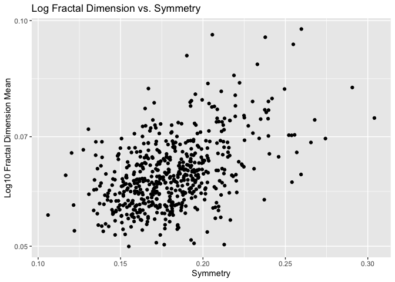<!-- -->

#### Research Question 2.

How well can the diagnosis of a tumour be predicted by its radius,
texture, smoothness, compactness, concavity, symmetry, and fractal
dimension? Similarly to the first research question, use the *mean*
variable for each attribute of the tumour.

**Summarizing:** Compute the *range*, *mean*, and *two other summary
statistics* of **one numerical variable** across the groups of **one
categorical variable** from your data. Interest in the predictability of
a tumours diagnosis from the variables listed above, it is intuitive to
observe their descriptive statistics to see if they each offer varying
qualities.

``` r
summary_table_2 <- cancer_sample %>% group_by(diagnosis) %>% 
                                    summarise(across(c(radius_mean, texture_mean, smoothness_mean, compactness_mean, concavity_mean, symmetry_mean, fractal_dimension_mean), 
                                                     list(min=min, max=max, mean=mean, sd=sd, IQR=IQR))) %>% 
                                    pivot_longer(-diagnosis,
                                                 names_to = c("variable",".value"),
                                                 names_pattern = "(.+)_(.+)")
(summary_table_2)
```

    ## # A tibble: 14 × 7
    ##    diagnosis variable                   min     max    mean      sd     IQR
    ##    <chr>     <chr>                    <dbl>   <dbl>   <dbl>   <dbl>   <dbl>
    ##  1 B         radius_mean             6.98   17.8    12.1    1.78    2.29   
    ##  2 B         texture_mean            9.71   33.8    17.9    4.00    4.61   
    ##  3 B         smoothness_mean         0.0526  0.163   0.0925 0.0134  0.0176 
    ##  4 B         compactness_mean        0.0194  0.224   0.0801 0.0337  0.0419 
    ##  5 B         concavity_mean          0       0.411   0.0461 0.0434  0.0397 
    ##  6 B         symmetry_mean           0.106   0.274   0.174  0.0248  0.031  
    ##  7 B         fractal_dimension_mean  0.0518  0.0958  0.0629 0.00675 0.00723
    ##  8 M         radius_mean            11.0    28.1    17.5    3.20    4.51   
    ##  9 M         texture_mean           10.4    39.3    21.6    3.78    4.44   
    ## 10 M         smoothness_mean         0.0737  0.145   0.103  0.0126  0.0169 
    ## 11 M         compactness_mean        0.0460  0.345   0.145  0.0540  0.0628 
    ## 12 M         concavity_mean          0.0240  0.427   0.161  0.0750  0.0935 
    ## 13 M         symmetry_mean           0.131   0.304   0.193  0.0276  0.0358 
    ## 14 M         fractal_dimension_mean  0.0500  0.0974  0.0627 0.00757 0.0105

**Graphing:** Create a graph of your choosing, make one of the axes
logarithmic, and format the axes labels so that they are “pretty” or
easier to read.

To investigate whether or not a variable may be useful in predicting a
cateogrical variable, it is useful to graph a side-by-side boxplot to
see if the variable is noticeably different for each class. Using a
log-scale will help disregard outliers.

``` r
cancer_sample %>% ggplot(aes(diagnosis, log(radius_mean), fill=factor(diagnosis))) + geom_boxplot() + xlab("Diagnosis") + ylab("log Radius") + ggtitle("Log-Scaled Radius Boxplot")
```

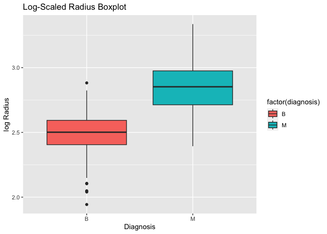<!-- -->

``` r
cancer_sample %>% ggplot(aes(diagnosis, log(texture_mean), fill=factor(diagnosis))) + geom_boxplot() + xlab("Diagnosis") + ylab("log Texture") + ggtitle("Log-Scaled Radius Boxplot")
```

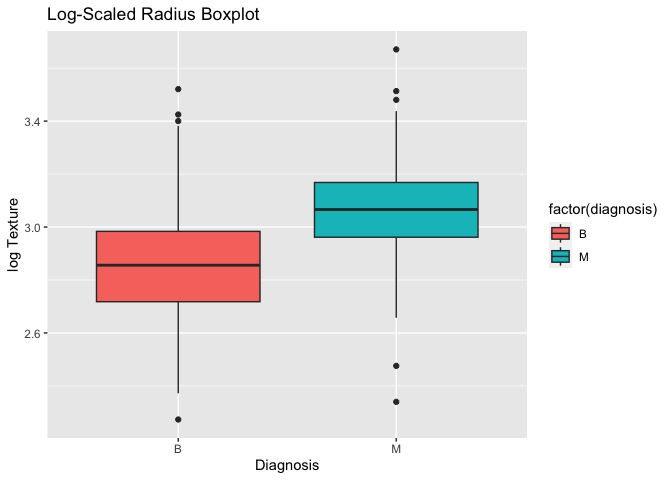<!-- -->

``` r
cancer_sample %>% ggplot(aes(diagnosis, log(smoothness_mean), fill=factor(diagnosis))) + geom_boxplot() + xlab("Diagnosis") + ylab("log Smoothness") + ggtitle("Log-Scaled Radius Boxplot")
```

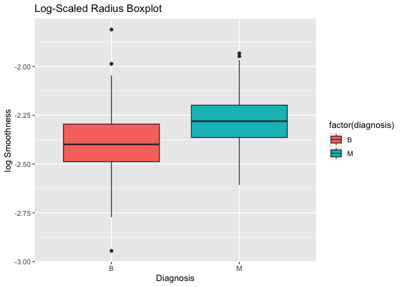<!-- -->

``` r
cancer_sample %>% ggplot(aes(diagnosis, log(compactness_mean), fill=factor(diagnosis))) + 
  geom_boxplot() + xlab("Diagnosis") + ylab("log Compactness") + ggtitle("Log-Scaled Radius Boxplot")
```

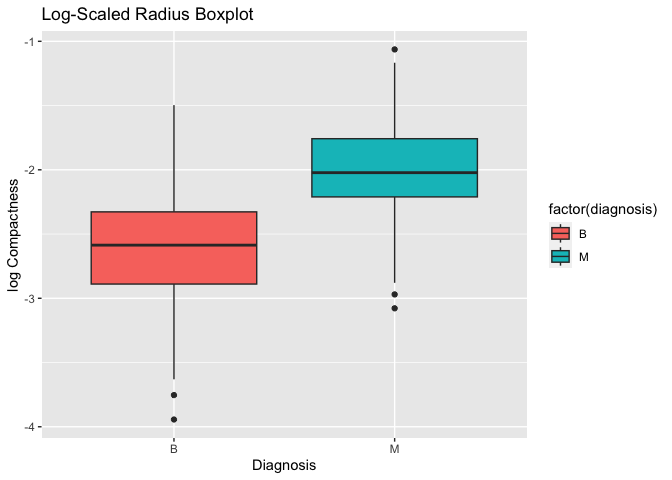<!-- -->

``` r
cancer_sample %>% ggplot(aes(diagnosis, log(concavity_mean), fill=factor(diagnosis))) + geom_boxplot() + xlab("Diagnosis") + ylab("log Concavity") + ggtitle("Log-Scaled Radius Boxplot")
```

    ## Warning: Removed 13 rows containing non-finite values (`stat_boxplot()`).

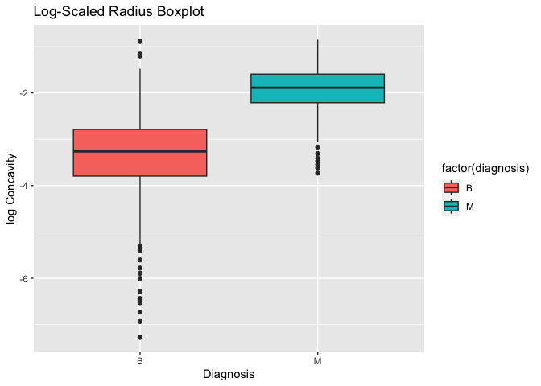<!-- -->

``` r
cancer_sample %>% ggplot(aes(diagnosis, log(symmetry_mean), fill=factor(diagnosis))) + geom_boxplot() + xlab("Diagnosis") + ylab("log Symmetry") + ggtitle("Log-Scaled Radius Boxplot")
```

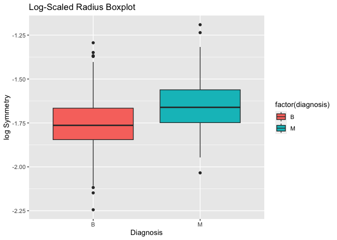<!-- -->

``` r
cancer_sample %>% ggplot(aes(diagnosis, log(fractal_dimension_mean), fill=factor(diagnosis))) + geom_boxplot() + xlab("Diagnosis") + ylab("log Fractal Dimension") + ggtitle("log Radius Boxplot")
```

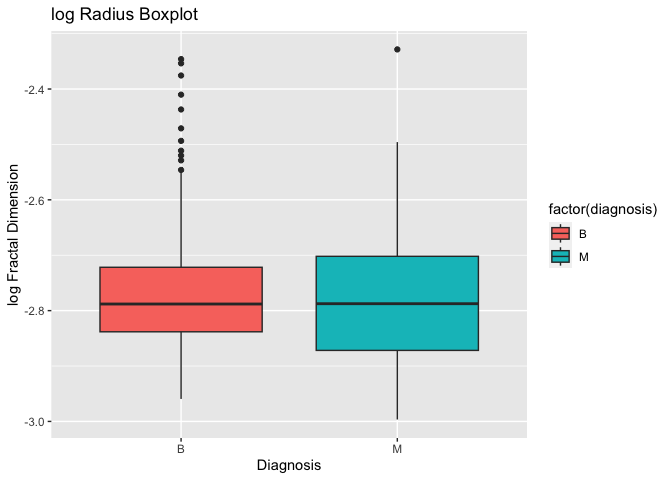<!-- -->

#### Research Question 3.

Are the worst values of tumour attributes related? (For example, are
smoothness_worst and concavity_worst related?)

**Summarizing:** Compute the *range*, *mean*, and *two other summary
statistics* of **one numerical variable** across the groups of **one
categorical variable** from your data.

Since most variables in the ***cancer_sample*** dataset are numerical,
the summarizing strategy above remains the best choice, especially
considering this research questions asks about whether or not these
variables are related.

``` r
summary_table_3 <- cancer_sample %>% group_by(diagnosis) %>% 
                                      summarise(across(ends_with("_worst"), 
                                                       list(min=min, max=max, mean=mean, sd=sd, IQR=IQR))) %>% 
                                      pivot_longer(-diagnosis,
                                                   names_to = c("variable",".value"),
                                                   names_pattern = "(.+)_(.+)")
(summary_table_3)
```

    ## # A tibble: 20 × 7
    ##    diagnosis variable                     min      max      mean      sd     IQR
    ##    <chr>     <chr>                      <dbl>    <dbl>     <dbl>   <dbl>   <dbl>
    ##  1 B         radius_worst              7.93     19.8     13.4    1.98e+0 2.72e+0
    ##  2 B         texture_worst            12.0      41.8     23.5    5.49e+0 6.93e+0
    ##  3 B         perimeter_worst          50.4     127.      87.0    1.35e+1 1.83e+1
    ##  4 B         area_worst              185.     1210      559.     1.64e+2 2.23e+2
    ##  5 B         smoothness_worst          0.0712    0.201    0.125  2.00e-2 2.72e-2
    ##  6 B         compactness_worst         0.0273    0.585    0.183  9.22e-2 1.18e-1
    ##  7 B         concavity_worst           0         1.25     0.166  1.40e-1 1.45e-1
    ##  8 B         concave_points_worst      0         0.175    0.0744 3.58e-2 4.65e-2
    ##  9 B         symmetry_worst            0.157     0.423    0.270  4.17e-2 5.77e-2
    ## 10 B         fractal_dimension_worst   0.0552    0.149    0.0794 1.38e-2 1.53e-2
    ## 11 M         radius_worst             12.8      36.0     21.1    4.28e+0 6.08e+0
    ## 12 M         texture_worst            16.7      49.5     29.3    5.43e+0 6.91e+0
    ## 13 M         perimeter_worst          85.1     251.     141.     2.95e+1 4.05e+1
    ## 14 M         area_worst              508.     4254     1422.     5.98e+2 7.42e+2
    ## 15 M         smoothness_worst          0.0882    0.223    0.145  2.19e-2 2.55e-2
    ## 16 M         compactness_worst         0.0513    1.06     0.375  1.70e-1 2.03e-1
    ## 17 M         concavity_worst           0.0240    1.17     0.451  1.82e-1 2.30e-1
    ## 18 M         concave_points_worst      0.0290    0.291    0.182  4.63e-2 5.79e-2
    ## 19 M         symmetry_worst            0.156     0.664    0.323  7.47e-2 8.27e-2
    ## 20 M         fractal_dimension_worst   0.0550    0.208    0.0915 2.16e-2 2.63e-2

**Graphing:** Create a graph of your choosing, make one of the axes
logarithmic, and format the axes labels so that they are “pretty” or
easier to read.

Take a few particular examples of interest, and compare their values in
a plot. The y-variable is log-scacled in each plot. It is expected for
*perimeter_worst* and *area_worst* to be related, as well as
*concavity_worst* and *concave_points_worst*.

``` r
cancer_sample %>% ggplot(aes(x = radius_worst, y = texture_worst)) + 
                geom_point()  + scale_y_log10("Log10 Texture Worst") + 
                xlab("Radius Worst") +
                ggtitle("Log Scaled Texture Worst vs. Radius Worst")
```

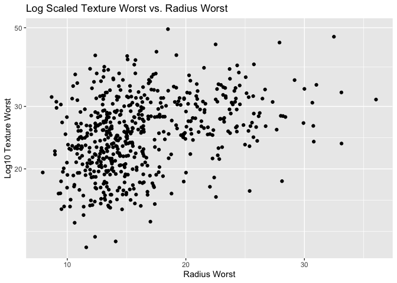<!-- -->

``` r
cancer_sample %>% ggplot(aes(x = perimeter_worst, y = area_worst)) + 
                geom_point()  + scale_y_log10("Log10 Area Worst") + 
                xlab("Perimeter Worst") +
                ggtitle("Log Scaled Area Worst vs. Perimeter Worst")
```

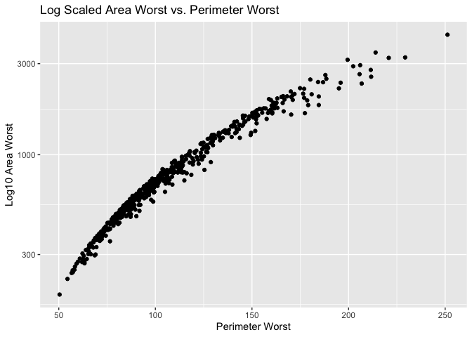<!-- -->

``` r
cancer_sample %>% ggplot(aes(x = smoothness_worst, y = compactness_worst)) + 
                geom_point()  + scale_y_log10("Log10 Compactness Worst") + 
                xlab("Smoothness Worst") +
                ggtitle("Log Scaled Compactness Worst vs. Smoothness Worst")
```

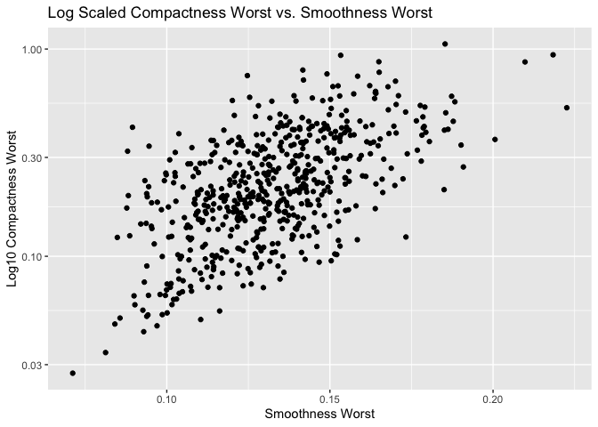<!-- -->

``` r
cancer_sample %>% ggplot(aes(x = concavity_worst, y = concave_points_worst)) + 
                geom_point()  + scale_y_log10("Log10 Concave Points Worst") + 
                xlab("Concavity Worst") +
                ggtitle("Log Scaled Concave Points Worst vs. Concavity Worst")
```

    ## Warning: Transformation introduced infinite values in continuous y-axis

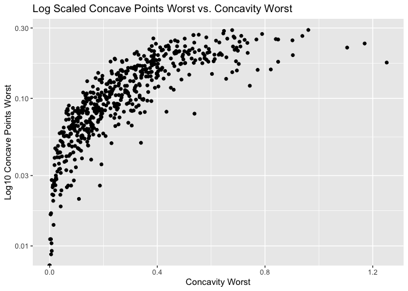<!-- -->

#### Research Question 4.

What is the optimal Logistic regression model to predict diagnosis?

**Summarizing:** Compute the number of observations for at least one of
your categorical variables.

It is logical to check the number of observations for the diagnoses of
the tumours. To find an appropriate Logistic regression model, one would
hope for the classes M and D to be relatively balanced and abundant.

``` r
summary_table_4 <- cancer_sample %>% group_by(diagnosis) %>% summarise(n = n())
(summary_table_4)
```

    ## # A tibble: 2 × 2
    ##   diagnosis     n
    ##   <chr>     <int>
    ## 1 B           357
    ## 2 M           212

It seems 357 observations have a benign diagnosis and 212 observations
have a malignant diagnosis.

**Graphing:** Create a graph that has at least two geom layers.

Below is a geom barplot of the count for each class of the diagnosis
veriable. Another geom text layer is added.

``` r
cancer_sample %>% ggplot(aes(x = diagnosis, fill = diagnosis)) + geom_bar() + geom_text(stat='count', aes(label=after_stat(count)), vjust=-0.4)
```

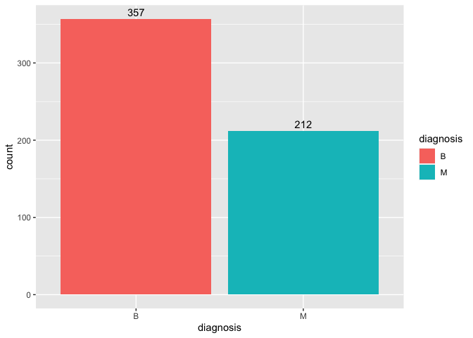<!-- -->

<!----------------------------------------------------------------------------->

### 1.3 (2 points)

Based on the operations that you’ve completed, how much closer are you
to answering your research questions? Think about what aspects of your
research questions remain unclear. Can your research questions be
refined, now that you’ve investigated your data a bit more? Which
research questions are yielding interesting results?

<!------------------------- Write your answer here ---------------------------->

Recall the research questions investigated above: 1. Is the symmetry and
fractal dimension of a tumour related? 2. How well can the diagnosis of
a tumour be predicted by its radius, texture, smoothness, compactness,
concavity, symmetry, and fractal dimension? 3. Are the worst values of
tumour attributes related? (For example, are smoothness_worst and
concavity_worst related?) 4. What is the optimal Logistic regression
model to predict diagnosis?

Questions 1 and 3 each deal with whether variables the in dataset are
related. The question can be answered tentatively using the plots above.
A strong linear or non-linear relatinoship may be observed using
scattplots, which is seen for variables such as area and perimeter.
Further steps may include computing the correlation between variables
numerically.

Research question 2 asks if a subset of variables in the
***cancer_sample*** dataset may be used to predict the diagnosis of the
tumour. The boxplots above are reason to suspect a variable may or may
not be useful in predicting the diagnosis variable, but it is difficult
to say for certain without building and testing a model. The research
question can be refined to instead ask: “Do the descriptive statistics
of the radius, texture, smoothness, compactness, concavity, symmetry,
and fractal dimension variables vary for each class in the diagnosis
variable?”. These results are fairly interesting, and may help in
further investigation for research question 4.

Research question 4 is not answered by the summary and graph above. It
seems there are sufficient observations to build and test a logistic
regression model to predict the diagnosis of a tumour, but there is
still much work to be done to answer the original question.

<!----------------------------------------------------------------------------->

# Task 2: Tidy your data

In this task, we will do several exercises to reshape our data. The goal
here is to understand how to do this reshaping with the `tidyr` package.

A reminder of the definition of *tidy* data:

- Each row is an **observation**
- Each column is a **variable**
- Each cell is a **value**

### 2.1 (2 points)

Based on the definition above, can you identify if your data is tidy or
untidy? Go through all your columns, or if you have \>8 variables, just
pick 8, and explain whether the data is untidy or tidy.

<!--------------------------- Start your work below --------------------------->

The ***cancer_sample*** dataset is tidy. Each tumour attribute (e.g.,
radius, texture, perimeter, etc.) it reflected in multiple variables
with three distinct statistics (e.g. radius_mean, radius_se,
radius_worst). This allows each row to be an observation, each column to
be a distinct variable, and each cell to be a value. Notably, each row
represents a unique tumour.
<!----------------------------------------------------------------------------->

### 2.2 (4 points)

Now, if your data is tidy, untidy it! Then, tidy it back to it’s
original state.

If your data is untidy, then tidy it! Then, untidy it back to it’s
original state.

Be sure to explain your reasoning for this task. Show us the “before”
and “after”.

<!--------------------------- Start your work below --------------------------->

To untidy the data, I will pivot longer to add a categorical variable
with levels mean, se, and worst. Each attribute of the tumour will stand
alone as one of the following: radius, texture, perimeter, area,
smoothness, compactness, concavity, concave_points, symmetry, or fractal
dimension. To carry this out, *pivot_longer* will be used on all columns
except for ID and diagnosis. Variable names will by spliced on the last
underscore in the string. For example, radius_mean will be spliced to be
radius (variable name) and mean (statistic value). This is done using a
REGEX expression: \*\*(.\*)\_(.\*)\*\*.

``` r
cancer_sample_untidy <- cancer_sample %>% pivot_longer(cols = c(-ID, -diagnosis), names_to = c(".value", "statistic"), names_pattern = '(.*)_(.*)')
cancer_sample_untidy
```

    ## # A tibble: 1,707 × 13
    ##          ID diagnosis statistic radius texture perimeter   area smoothness
    ##       <dbl> <chr>     <chr>      <dbl>   <dbl>     <dbl>  <dbl>      <dbl>
    ##  1   842302 M         mean      18.0    10.4      123.   1001      0.118  
    ##  2   842302 M         se         1.10    0.905      8.59  153.     0.00640
    ##  3   842302 M         worst     25.4    17.3      185.   2019      0.162  
    ##  4   842517 M         mean      20.6    17.8      133.   1326      0.0847 
    ##  5   842517 M         se         0.544   0.734      3.40   74.1    0.00522
    ##  6   842517 M         worst     25.0    23.4      159.   1956      0.124  
    ##  7 84300903 M         mean      19.7    21.2      130    1203      0.110  
    ##  8 84300903 M         se         0.746   0.787      4.58   94.0    0.00615
    ##  9 84300903 M         worst     23.6    25.5      152.   1709      0.144  
    ## 10 84348301 M         mean      11.4    20.4       77.6   386.     0.142  
    ## # ℹ 1,697 more rows
    ## # ℹ 5 more variables: compactness <dbl>, concavity <dbl>, concave_points <dbl>,
    ## #   symmetry <dbl>, fractal_dimension <dbl>

This dataset is untidy because each tumour is represented by several
rows. In other words, each row is **not** a single observation. To tidy
the dataset, it is necessary to picot wider so the each tumour is
reflected in a single row.

``` r
cancer_sample_tidy <- cancer_sample_untidy %>% pivot_wider(names_from = statistic, values_from = c(-ID, -diagnosis, -statistic)) 
cancer_sample_tidy
```

    ## # A tibble: 569 × 32
    ##          ID diagnosis radius_mean radius_se radius_worst texture_mean texture_se
    ##       <dbl> <chr>           <dbl>     <dbl>        <dbl>        <dbl>      <dbl>
    ##  1   842302 M                18.0     1.10          25.4         10.4      0.905
    ##  2   842517 M                20.6     0.544         25.0         17.8      0.734
    ##  3 84300903 M                19.7     0.746         23.6         21.2      0.787
    ##  4 84348301 M                11.4     0.496         14.9         20.4      1.16 
    ##  5 84358402 M                20.3     0.757         22.5         14.3      0.781
    ##  6   843786 M                12.4     0.334         15.5         15.7      0.890
    ##  7   844359 M                18.2     0.447         22.9         20.0      0.773
    ##  8 84458202 M                13.7     0.584         17.1         20.8      1.38 
    ##  9   844981 M                13       0.306         15.5         21.8      1.00 
    ## 10 84501001 M                12.5     0.298         15.1         24.0      1.60 
    ## # ℹ 559 more rows
    ## # ℹ 25 more variables: texture_worst <dbl>, perimeter_mean <dbl>,
    ## #   perimeter_se <dbl>, perimeter_worst <dbl>, area_mean <dbl>, area_se <dbl>,
    ## #   area_worst <dbl>, smoothness_mean <dbl>, smoothness_se <dbl>,
    ## #   smoothness_worst <dbl>, compactness_mean <dbl>, compactness_se <dbl>,
    ## #   compactness_worst <dbl>, concavity_mean <dbl>, concavity_se <dbl>,
    ## #   concavity_worst <dbl>, concave_points_mean <dbl>, …

It is easy to check if ***cancer_sample_tidy*** contains identicle
information is the original dataset ***cancer_sample***. Based on the
work done above, it is expected that the datasets are the same, with
columns re-ordered. To test this, the columns are reordered
alphabetically and then each cell may be tested. If all cells match
between the two re-ordered datasets, then the following will return
TRUE.

``` r
all(cancer_sample_tidy[,order(names(cancer_sample_tidy))] == cancer_sample[,order(names(cancer_sample))])
```

    ## [1] TRUE

<!----------------------------------------------------------------------------->

### 2.3 (4 points)

Now, you should be more familiar with your data, and also have made
progress in answering your research questions. Based on your interest,
and your analyses, pick 2 of the 4 research questions to continue your
analysis in the remaining tasks:

<!-------------------------- Start your work below ---------------------------->

1.  *Is the symmetry and fractal dimension of a tumour related?*
2.  *How well can the diagnosis of a tumour be predicted by its radius,
    texture, smoothness, compactness, concavity, symmetry, and fractal
    dimension?*

<!----------------------------------------------------------------------------->

Explain your decision for choosing the above two research questions.

<!--------------------------- Start your work below --------------------------->

For research question 1 copied above, it seems reasonable to ask if two
variables are related. Each variable is described using three
statistics: mean, se, and worst. It is reasonable to ask if each
statistics of each tumour is related. This will allow me to better
understand these variables, and deduce if they are likley to be related.
If they are related, it makes sense to only include one of them in a
predictive model.

For research question 2, it is reasonable to build a model using a small
subset of the variables given what was learned in class. Additionally,
the ability to predict whether or not a tumour is benign or malignant
seems like a powerful and interesting tool.

<!----------------------------------------------------------------------------->

Now, try to choose a version of your data that you think will be
appropriate to answer these 2 questions. Use between 4 and 8 functions
that we’ve covered so far (i.e. by filtering, cleaning, tidy’ing,
dropping irrelevant columns, etc.).

(If it makes more sense, then you can make/pick two versions of your
data, one for each research question.)

<!--------------------------- Start your work below --------------------------->

I will pick two version of the data for each research question noted in
2.3. Call them ***cancer_sample_1*** and ***cancer_sample_2*** for
research question 1 and 2 respectively.

``` r
## Interested in symmetry and fractal dimension, so filter out all unrelated variables. 
cancer_sample_1 <- cancer_sample %>% select(starts_with(c('symmetry', 'fractal_dimension'))) %>% arrange()
cancer_sample_1
```

    ## # A tibble: 569 × 6
    ##    symmetry_mean symmetry_se symmetry_worst fractal_dimension_mean
    ##            <dbl>       <dbl>          <dbl>                  <dbl>
    ##  1         0.242      0.0300          0.460                 0.0787
    ##  2         0.181      0.0139          0.275                 0.0567
    ##  3         0.207      0.0225          0.361                 0.0600
    ##  4         0.260      0.0596          0.664                 0.0974
    ##  5         0.181      0.0176          0.236                 0.0588
    ##  6         0.209      0.0216          0.398                 0.0761
    ##  7         0.179      0.0137          0.306                 0.0574
    ##  8         0.220      0.0149          0.320                 0.0745
    ##  9         0.235      0.0214          0.438                 0.0739
    ## 10         0.203      0.0179          0.437                 0.0824
    ## # ℹ 559 more rows
    ## # ℹ 2 more variables: fractal_dimension_se <dbl>, fractal_dimension_worst <dbl>

``` r
## Interested in diagnosis, radius, texture, smoothness, compactness, concavity, symmetry, and fractal dimension. Filter out non-distinct rows in case data is updated. 
## Mutate the diagnosis variable so that the levels are represetned with numerical values. This will help when we apply glm() later. 
cancer_sample_2 <- cancer_sample %>% 
                    arrange() %>% 
                    select(diagnosis, starts_with(c('radius', 'texture', 'smoothness', 'compactness', 'concavity', 'symmetry', 'fractal_dimension'))) %>% 
                    distinct() %>% 
                    mutate(diagnosis = case_when(diagnosis == 'M' ~ 1,
                                                 diagnosis == 'B' ~ 0))
cancer_sample_2
```

    ## # A tibble: 569 × 22
    ##    diagnosis radius_mean radius_se radius_worst texture_mean texture_se
    ##        <dbl>       <dbl>     <dbl>        <dbl>        <dbl>      <dbl>
    ##  1         1        18.0     1.10          25.4         10.4      0.905
    ##  2         1        20.6     0.544         25.0         17.8      0.734
    ##  3         1        19.7     0.746         23.6         21.2      0.787
    ##  4         1        11.4     0.496         14.9         20.4      1.16 
    ##  5         1        20.3     0.757         22.5         14.3      0.781
    ##  6         1        12.4     0.334         15.5         15.7      0.890
    ##  7         1        18.2     0.447         22.9         20.0      0.773
    ##  8         1        13.7     0.584         17.1         20.8      1.38 
    ##  9         1        13       0.306         15.5         21.8      1.00 
    ## 10         1        12.5     0.298         15.1         24.0      1.60 
    ## # ℹ 559 more rows
    ## # ℹ 16 more variables: texture_worst <dbl>, smoothness_mean <dbl>,
    ## #   smoothness_se <dbl>, smoothness_worst <dbl>, compactness_mean <dbl>,
    ## #   compactness_se <dbl>, compactness_worst <dbl>, concavity_mean <dbl>,
    ## #   concavity_se <dbl>, concavity_worst <dbl>, symmetry_mean <dbl>,
    ## #   symmetry_se <dbl>, symmetry_worst <dbl>, fractal_dimension_mean <dbl>,
    ## #   fractal_dimension_se <dbl>, fractal_dimension_worst <dbl>

``` r
## Four functions used: select(), arrange(), starts_with(), distinct(), mutate(), case_when()
```

<!----------------------------------------------------------------------------->
<!--------------------------- Start your work below --------------------------->

# Task 3: Modelling

## 3.0 (no points)

Pick a research question from 1.2, and pick a variable of interest
(we’ll call it “Y”) that’s relevant to the research question. Indicate
these.

<!-------------------------- Start your work below ---------------------------->

**Research Question**: How well can the diagnosis of a tumour be
predicted by its radius, texture, smoothness, compactness, concavity,
symmetry, and fractal dimension?

**Variable of interest**: diagnosis

<!----------------------------------------------------------------------------->

## 3.1 (3 points)

Fit a model or run a hypothesis test that provides insight on this
variable with respect to the research question. Store the model object
as a variable, and print its output to screen. We’ll omit having to
justify your choice, because we don’t expect you to know about model
specifics in STAT 545.

- **Note**: It’s OK if you don’t know how these models/tests work. Here
  are some examples of things you can do here, but the sky’s the limit.

  - You could fit a model that makes predictions on Y using another
    variable, by using the `lm()` function.
  - You could test whether the mean of Y equals 0 using `t.test()`, or
    maybe the mean across two groups are different using `t.test()`, or
    maybe the mean across multiple groups are different using `anova()`
    (you may have to pivot your data for the latter two).
  - You could use `lm()` to test for significance of regression
    coefficients.

<!-------------------------- Start your work below ---------------------------->

The following code builds a logistic regression model to predict the
diagnosis of a tumour using the variables in ***cancer_sample_2***.
First the data is split into a training and testing set.

``` r
## For reproducibility
set.seed(123)
train_ind <- sample(seq_len(nrow(cancer_sample_2)), size = floor(0.7 * nrow(cancer_sample_2)))
cancer_sample_train <- cancer_sample_2 %>% slice(train_ind)
cancer_sample_test <- cancer_sample_2 %>% slice(-train_ind)


cancer_model <- glm(diagnosis ~ ., data = cancer_sample_train, family = "binomial")
```

    ## Warning: glm.fit: fitted probabilities numerically 0 or 1 occurred

``` r
(cancer_model)
```

    ## 
    ## Call:  glm(formula = diagnosis ~ ., family = "binomial", data = cancer_sample_train)
    ## 
    ## Coefficients:
    ##             (Intercept)              radius_mean                radius_se  
    ##                -70.6163                  -0.2821                  20.4701  
    ##            radius_worst             texture_mean               texture_se  
    ##                  1.8997                  -0.1628                  -3.1171  
    ##           texture_worst          smoothness_mean            smoothness_se  
    ##                  0.6498                 160.5679                 629.1879  
    ##        smoothness_worst         compactness_mean           compactness_se  
    ##                -65.1135                 -71.1704                 -74.2262  
    ##       compactness_worst           concavity_mean             concavity_se  
    ##                  4.7150                  68.9653                 -31.4533  
    ##         concavity_worst            symmetry_mean              symmetry_se  
    ##                  4.9974                  14.4620                  97.8459  
    ##          symmetry_worst   fractal_dimension_mean     fractal_dimension_se  
    ##                 -0.7852                 -14.9858               -1359.7224  
    ## fractal_dimension_worst  
    ##                223.5215  
    ## 
    ## Degrees of Freedom: 397 Total (i.e. Null);  376 Residual
    ## Null Deviance:       515 
    ## Residual Deviance: 40.83     AIC: 84.83

<!----------------------------------------------------------------------------->

## 3.2 (3 points)

Produce something relevant from your fitted model: either predictions on
Y, or a single value like a regression coefficient or a p-value.

- Be sure to indicate in writing what you chose to produce.
- Your code should either output a tibble (in which case you should
  indicate the column that contains the thing you’re looking for), or
  the thing you’re looking for itself.
- Obtain your results using the `broom` package if possible. If your
  model is not compatible with the broom function you’re needing, then
  you can obtain your results by some other means, but first indicate
  which broom function is not compatible.

<!-------------------------- Start your work below ---------------------------->

The following code uses the predict() function to make predictions on Y
(diagnosis). This satisfies the original research question, to
investigate if the diangosis of a tumour may be predicted using its
characteristics. To visualize the results, add the predictions to a new
dataset, ***cancer_predictions*** dataset and plot.

``` r
predictions_list <- predict(cancer_model, newdata = cancer_sample_test, type = "response")
cancer_predictions <- cancer_sample_test %>% select(diagnosis) %>% 
                                        mutate(predictions = predictions_list, 
                                               index = 1:nrow(.), 
                                               correct = case_when(predictions >= 0.5 & diagnosis == 1 ~ TRUE,
                                                                   predictions >= 0.5 & diagnosis == 0 ~ FALSE,
                                                                   predictions < 0.5 & diagnosis == 0 ~ TRUE,
                                                                   predictions < 0.5 & diagnosis == 1 ~ FALSE
                                                                   )) %>% 
                                        select(index, everything()) 
                      

cancer_predictions %>% ggplot(aes(x=index, y=predictions, color = correct)) + geom_point() + ggtitle("Cancer Predictions Plot") + xlab("Index") + ylab("Prediction")
```

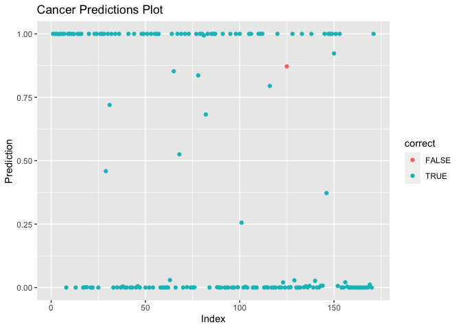<!-- -->
<!----------------------------------------------------------------------------->

# Task 4: Reading and writing data

Get set up for this exercise by making a folder called `output` in the
top level of your project folder / repository. You’ll be saving things
there.

## 4.1 (3 points)

Take a summary table that you made from Task 1, and write it as a csv
file in your `output` folder. Use the `here::here()` function.

- **Robustness criteria**: You should be able to move your Mini Project
  repository / project folder to some other location on your computer,
  or move this very Rmd file to another location within your project
  repository / folder, and your code should still work.
- **Reproducibility criteria**: You should be able to delete the csv
  file, and remake it simply by knitting this Rmd file.

<!-------------------------- Start your work below ---------------------------->

Choose the second summary table from Task 1. If the file already exists
in the output folder, the following code will delete it before a new
file is written.

``` r
## Check if file exists, delete if it does
if (file.exists(here::here("output/summary_table_2.csv"))) {file.remove(here::here("output/summary_table_2.csv"))}
```

    ## [1] TRUE

``` r
## Write file
write_csv(summary_table_2, here::here("output/summary_table_2.csv"))
```

<!----------------------------------------------------------------------------->

## 4.2 (3 points)

Write your model object from Task 3 to an R binary file (an RDS), and
load it again. Be sure to save the binary file in your `output` folder.
Use the functions `saveRDS()` and `readRDS()`.

- The same robustness and reproducibility criteria as in 4.1 apply here.

<!-------------------------- Start your work below ---------------------------->

``` r
## Check if file exists, delete if it does
if (file.exists(here::here("output/cancer_model.RDS"))) {file.remove(here::here("output/cancer_model.RDS"))}
```

    ## [1] TRUE

``` r
## Save file
saveRDS(cancer_model, here::here("output/cancer_model.RDS"))

## Load file
cancer_model <- readRDS(here::here("output/cancer_model.RDS"))
```

<!----------------------------------------------------------------------------->

# Overall Reproducibility/Cleanliness/Coherence Checklist

Here are the criteria we’re looking for.

## Coherence (0.5 points)

The document should read sensibly from top to bottom, with no major
continuity errors.

The README file should still satisfy the criteria from the last
milestone, i.e. it has been updated to match the changes to the
repository made in this milestone.

## File and folder structure (1 points)

You should have at least three folders in the top level of your
repository: one for each milestone, and one output folder. If there are
any other folders, these are explained in the main README.

Each milestone document is contained in its respective folder, and
nowhere else.

Every level-1 folder (that is, the ones stored in the top level, like
“Milestone1” and “output”) has a `README` file, explaining in a sentence
or two what is in the folder, in plain language (it’s enough to say
something like “This folder contains the source for Milestone 1”).

## Output (1 point)

All output is recent and relevant:

- All Rmd files have been `knit`ted to their output md files.
- All knitted md files are viewable without errors on Github. Examples
  of errors: Missing plots, “Sorry about that, but we can’t show files
  that are this big right now” messages, error messages from broken R
  code
- All of these output files are up-to-date – that is, they haven’t
  fallen behind after the source (Rmd) files have been updated.
- There should be no relic output files. For example, if you were
  knitting an Rmd to html, but then changed the output to be only a
  markdown file, then the html file is a relic and should be deleted.

Our recommendation: delete all output files, and re-knit each
milestone’s Rmd file, so that everything is up to date and relevant.

## Tagged release (0.5 point)

You’ve tagged a release for Milestone 2.

### Attribution

Thanks to Victor Yuan for mostly putting this together.
